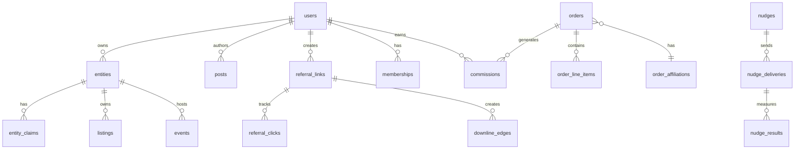

# Yalls Platform - Entity Relationship Diagram

> **Version**: 1.0  
> **Last Updated**: 2025-01-XX

---

## Quick Reference

---

## Identity & Access

### `auth.users` (Supabase managed)
Core authentication; **never store business logic here**.

| Column | Type | Notes |
|--------|------|-------|
| id | uuid | PK |
| email | text | Unique, verified |
| created_at | timestamptz | |

---

### `entities`
Unified registry for people, businesses, horses, events.

| Column | Type | Constraints | Notes |
|--------|------|-------------|-------|
| id | uuid | PK | |
| kind | enum | ['person','business','horse','event'] | |
| handle | text | Unique | URL-safe identifier |
| status | enum | ['unclaimed','claimed','verified'] | |
| owner_user_id | uuid | FK → users.id, nullable | Null if unclaimed |
| metadata | jsonb | {} | Custom attributes per kind |
| created_at | timestamptz | NOT NULL | First seen date |
| updated_at | timestamptz | | |

**RLS**: 
- SELECT: public
- INSERT: authenticated
- UPDATE/DELETE: owner OR admin

---

### `entity_claims`
Claim history and contributor tracking.

| Column | Type | Constraints | Notes |
|--------|------|-------------|-------|
| id | uuid | PK | |
| entity_id | uuid | FK → entities.id | |
| claimant_user_id | uuid | FK → users.id | |
| method | text | | 'email', 'sms', 'manual' |
| evidence | jsonb | | Uploaded docs, verification data |
| status | enum | ['pending','approved','rejected'] | |
| first_seen_at | timestamptz | | Provenance timestamp |
| claimed_at | timestamptz | | When claim submitted |
| contributor_user_id | uuid | FK → users.id, nullable | Original creator |
| window | enum | ['30','60','90'], nullable | Days until bounty expires |
| created_at | timestamptz | | |

**Indexes**:
- `idx_entity_claims_entity` ON (entity_id)
- `idx_entity_claims_claimant` ON (claimant_user_id)
- `idx_entity_claims_contributor` ON (contributor_user_id)

**RLS**:
- SELECT: owner OR admin
- INSERT: authenticated (self only)
- UPDATE: admin only

---

### `contributors`
Trust scoring for entity creators.

| Column | Type | Constraints | Notes |
|--------|------|-------------|-------|
| user_id | uuid | PK, FK → users.id | |
| trust_score | numeric | DEFAULT 0.5 | 0.0 - 1.0 |
| entities_created | int | DEFAULT 0 | |
| entities_claimed | int | DEFAULT 0 | |
| bounties_earned_cents | int | DEFAULT 0 | |
| created_at | timestamptz | | |

---

## Capability System (Exists)

### `features`
Feature registry (already implemented).

### `account_capabilities`  
User feature access (already implemented).

### `capability_gaps`
Feature requests from users (already implemented).

---

## Social & Content

### `posts`
User-generated content.

| Column | Type | Constraints | Notes |
|--------|------|-------------|-------|
| id | uuid | PK | |
| author_id | uuid | FK → users.id | |
| entity_id | uuid | FK → entities.id, nullable | Attached listing/event |
| body | text | | |
| media | jsonb | [] | Array of {url, type, width, height} |
| visibility | enum | ['public','followers','private'] | |
| created_at | timestamptz | | |
| updated_at | timestamptz | | |

**Indexes**:
- `idx_posts_author` ON (author_id, created_at DESC)
- `idx_posts_entity` ON (entity_id, created_at DESC)

**RLS**:
- SELECT: visibility-aware
- INSERT/UPDATE/DELETE: author OR admin

---

### `post_reactions`
Likes, hearts, etc.

| Column | Type | Constraints | Notes |
|--------|------|-------------|-------|
| id | uuid | PK | |
| post_id | uuid | FK → posts.id | |
| user_id | uuid | FK → users.id | |
| kind | enum | ['like','heart','fire'] | |
| created_at | timestamptz | | |

**Unique**: (post_id, user_id, kind)

---

### `messages`
Direct messages.

| Column | Type | Constraints | Notes |
|--------|------|-------------|-------|
| id | uuid | PK | |
| sender_id | uuid | FK → users.id | |
| recipient_id | uuid | FK → users.id | |
| body | text | | |
| meta | jsonb | {} | Disclosure flags, referral links |
| read_at | timestamptz | nullable | |
| created_at | timestamptz | | |

**Indexes**:
- `idx_messages_thread` ON (sender_id, recipient_id, created_at DESC)

**RLS**:
- SELECT: sender OR recipient OR admin
- INSERT: sender only

---

## CRM

### `crm_contacts`
Customer/lead records.

| Column | Type | Constraints | Notes |
|--------|------|-------------|-------|
| id | uuid | PK | |
| owner_user_id | uuid | FK → users.id | Business or user |
| name | text | | |
| email | text | nullable | |
| phone | text | nullable | |
| tags | text[] | {} | Segmentation |
| metadata | jsonb | {} | Custom fields |
| created_at | timestamptz | | |
| updated_at | timestamptz | | |

**Indexes**:
- `idx_crm_contacts_owner` ON (owner_user_id)
- `idx_crm_contacts_email` ON (email) WHERE email IS NOT NULL

**RLS**:
- ALL: owner OR team member OR admin

---

### `crm_events` (partitionable)
Timeline of interactions.

| Column | Type | Constraints | Notes |
|--------|------|-------------|-------|
| id | uuid | PK | |
| contact_id | uuid | FK → crm_contacts.id | |
| type | text | | 'viewed','listed','cart','order','rsvp' |
| data | jsonb | {} | Event-specific payload |
| occurred_at | timestamptz | | |

**Partition**: BY RANGE (occurred_at) monthly

**Indexes**:
- `idx_crm_events_contact` ON (contact_id, occurred_at DESC)

---

### `tasks`
Follow-up actions.

| Column | Type | Constraints | Notes |
|--------|------|-------------|-------|
| id | uuid | PK | |
| owner_user_id | uuid | FK → users.id | |
| subject | text | | |
| due_at | timestamptz | nullable | |
| status | enum | ['open','done','canceled'] | |
| related_entity_id | uuid | FK → entities.id, nullable | |
| created_at | timestamptz | | |

---

## Marketplace

### `listings`
Products/services for sale.

| Column | Type | Constraints | Notes |
|--------|------|-------------|-------|
| id | uuid | PK | |
| seller_entity_id | uuid | FK → entities.id | |
| title | text | NOT NULL | |
| description | text | | |
| media | jsonb | [] | Images, videos |
| attributes | jsonb | {} | Variant-specific (size, color, etc.) |
| price_cents | int | NOT NULL | |
| stock_qty | int | DEFAULT 0 | |
| status | enum | ['draft','active','sold','archived'] | |
| created_at | timestamptz | | |
| updated_at | timestamptz | | |

**Indexes**:
- `idx_listings_seller` ON (seller_entity_id, status)
- `idx_listings_status` ON (status, created_at DESC)

**RLS**:
- SELECT: status='active' OR owner OR admin
- INSERT/UPDATE/DELETE: owner OR admin

---

### `events`
Ticketed events.

| Column | Type | Constraints | Notes |
|--------|------|-------------|-------|
| id | uuid | PK | |
| host_entity_id | uuid | FK → entities.id | |
| title | text | NOT NULL | |
| description | text | | |
| starts_at | timestamptz | NOT NULL | |
| ends_at | timestamptz | | |
| location | jsonb | {} | {address, coords, venue_name} |
| ticket_classes | jsonb | [] | [{name, price_cents, qty}] |
| capacity | int | nullable | |
| status | enum | ['draft','published','canceled'] | |
| created_at | timestamptz | | |

---

### `carts`
Shopping cart sessions.

| Column | Type | Constraints | Notes |
|--------|------|-------------|-------|
| id | uuid | PK | |
| user_id | uuid | FK → users.id, nullable | Null for guest |
| session_id | text | nullable | Anonymous identifier |
| created_at | timestamptz | | |
| updated_at | timestamptz | | |

**Unique**: (user_id) WHERE user_id IS NOT NULL  
**Unique**: (session_id) WHERE session_id IS NOT NULL

**RLS**: JWT `session_id` claim match (see `cart_get` function)

---

### `cart_items`
Items in cart.

| Column | Type | Constraints | Notes |
|--------|------|-------------|-------|
| id | uuid | PK | |
| cart_id | uuid | FK → carts.id | |
| listing_id | uuid | FK → listings.id | |
| qty | int | NOT NULL, CHECK (qty > 0) | |
| unit_price_cents | int | NOT NULL | Snapshot at add-time |
| variant | jsonb | {} | Selected attributes |
| created_at | timestamptz | | |

**Unique**: (cart_id, listing_id, variant) via constraint `shopping_cart_items_uniq`

---

### `orders`
Completed purchases.

| Column | Type | Constraints | Notes |
|--------|------|-------------|-------|
| id | uuid | PK | |
| buyer_user_id | uuid | FK → users.id | |
| seller_entity_id | uuid | FK → entities.id | |
| subtotal_cents | int | NOT NULL | |
| tax_cents | int | DEFAULT 0 | |
| shipping_cents | int | DEFAULT 0 | |
| total_cents | int | NOT NULL | |
| status | enum | ['created','paid','fulfilled','refunded','canceled'] | |
| mock_paid_at | timestamptz | nullable | Phase 0-7 mock |
| label_printed_at | timestamptz | nullable | Gates commissions |
| stripe_payment_intent_id | text | nullable | Phase 8 |
| idempotency_key | text | UNIQUE | |
| created_at | timestamptz | | |
| updated_at | timestamptz | | |

**Indexes**:
- `idx_orders_buyer` ON (buyer_user_id, created_at DESC)
- `idx_orders_seller` ON (seller_entity_id, created_at DESC)
- `idx_orders_status` ON (status, created_at DESC)

---

### `order_line_items`
Order details.

| Column | Type | Constraints | Notes |
|--------|------|-------------|-------|
| id | uuid | PK | |
| order_id | uuid | FK → orders.id | |
| listing_id | uuid | FK → listings.id | |
| qty | int | NOT NULL | |
| unit_price_cents | int | NOT NULL | |
| variant | jsonb | {} | |
| created_at | timestamptz | | |

---

## Referrals & Attribution

### `referral_programs`
Configuration.

| Column | Type | Constraints | Notes |
|--------|------|-------------|-------|
| id | uuid | PK | |
| name | text | | 'default', 'pro', 'elite' |
| default_rate_pct | numeric | | Base commission % |
| cookie_days | int | DEFAULT 30 | Attribution window |
| last_click_wins | bool | DEFAULT true | |
| created_at | timestamptz | | |

---

### `referral_links`
Trackable share links.

| Column | Type | Constraints | Notes |
|--------|------|-------------|-------|
| id | uuid | PK | |
| code | text | UNIQUE, NOT NULL | Short code |
| owner_user_id | uuid | FK → users.id | |
| program_id | uuid | FK → referral_programs.id | |
| target_type | enum | ['listing','event','profile','join','generic'] | |
| target_id | uuid | nullable | FK to target table |
| utm | jsonb | {} | Campaign tracking |
| status | enum | ['active','paused','expired'] | |
| created_at | timestamptz | | |

**Indexes**:
- `idx_referral_links_code` ON (code)
- `idx_referral_links_owner` ON (owner_user_id)

---

### `referral_clicks`
Anonymous tracking.

| Column | Type | Constraints | Notes |
|--------|------|-------------|-------|
| id | uuid | PK | |
| link_id | uuid | FK → referral_links.id | |
| anon_session_id | text | NOT NULL | Browser/device fingerprint |
| ip_hash | text | | SHA256(ip + salt) |
| ua_hash | text | | SHA256(user_agent + salt) |
| clicked_at | timestamptz | DEFAULT NOW() | |

**Indexes**:
- `idx_referral_clicks_link` ON (link_id, clicked_at DESC)
- `idx_referral_clicks_session` ON (anon_session_id)

---

### `downline_edges`
Direct referral relationships.

| Column | Type | Constraints | Notes |
|--------|------|-------------|-------|
| referrer_user_id | uuid | FK → users.id | |
| referred_user_id | uuid | FK → users.id | |
| link_id | uuid | FK → referral_links.id, nullable | |
| created_at | timestamptz | | |

**Primary Key**: (referrer_user_id, referred_user_id)

---

### `order_affiliations`
Attribution record per order.

| Column | Type | Constraints | Notes |
|--------|------|-------------|-------|
| order_id | uuid | PK, FK → orders.id | |
| referrer_user_id | uuid | FK → users.id | |
| link_id | uuid | FK → referral_links.id, nullable | |
| source | enum | ['cookie','join_link','manual'] | |
| attributed_at | timestamptz | | |

---

## Commissions & Payouts

### `commission_schedules`
Pool split rules.

| Column | Type | Constraints | Notes |
|--------|------|-------------|-------|
| id | uuid | PK | |
| program_id | uuid | FK → referral_programs.id | |
| scope | enum | ['global','category','seller'] | |
| scope_id | uuid | nullable | Category or seller ID |
| rate_type | enum | ['pct','fixed'] | |
| rate_value | numeric | | Percentage or cents |
| active | bool | DEFAULT true | |

---

### `commissions`
Earning records.

| Column | Type | Constraints | Notes |
|--------|------|-------------|-------|
| id | uuid | PK | |
| order_id | uuid | FK → orders.id | |
| payee_user_id | uuid | FK → users.id | |
| line_type | enum | ['buyer','seller','business_onboarder'] | |
| tier | int | CHECK (tier IN (1,2,3)) | Depth in line |
| amount_cents | int | NOT NULL | |
| status | enum | ['pending','accrued','paid','void'] | |
| reason | text | | Why void/paid |
| created_at | timestamptz | | |
| accrued_at | timestamptz | nullable | After label + refund window |
| paid_at | timestamptz | nullable | |

**Indexes**:
- `idx_commissions_payee` ON (payee_user_id, status)
- `idx_commissions_order` ON (order_id)

---

### `memberships`
User tier subscription (billing in Phase 8).

| Column | Type | Constraints | Notes |
|--------|------|-------------|-------|
| user_id | uuid | PK, FK → users.id | |
| tier | enum | ['free','tier1','tier2'] | |
| starts_at | timestamptz | NOT NULL | |
| ends_at | timestamptz | nullable | null = forever |
| state | enum | ['active','lapsed','trial'] | |
| stripe_subscription_id | text | nullable | Phase 8 |
| updated_at | timestamptz | | |

**Capture Rates**:
- `free`: 1.0% of 4% pool
- `tier1`: 2.5% of 4% pool
- `tier2`: 4.0% of 4% pool

---

### `credits_ledger`
YallCoins balance tracking.

| Column | Type | Constraints | Notes |
|--------|------|-------------|-------|
| id | uuid | PK | |
| user_id | uuid | FK → users.id | |
| type | enum | ['purchase','gift_sent','gift_received','redeemed','promo','refund','adjust'] | |
| delta_cents | int | NOT NULL | Positive or negative |
| balance_cents_after | int | NOT NULL | Running total |
| order_id | uuid | FK → orders.id, nullable | If redeemed/refund |
| created_at | timestamptz | | |

**Indexes**:
- `idx_credits_ledger_user` ON (user_id, created_at DESC)

---

## Nudges & Persuasion

### `nudges`
Campaign definitions.

| Column | Type | Constraints | Notes |
|--------|------|-------------|-------|
| id | uuid | PK | |
| name | text | NOT NULL | Admin label |
| trigger | text | NOT NULL | 'cart_idle', 'prefill', 'social_proof' |
| eligibility | jsonb | {} | Rules: {membership, tags, cohort} |
| template | jsonb | {} | {title, body, cta, image_url} |
| caps | jsonb | {} | {per_user_per_day, total_cap} |
| status | enum | ['draft','active','paused','retired'] | |
| starts_at | timestamptz | nullable | |
| ends_at | timestamptz | nullable | |
| created_at | timestamptz | | |

---

### `nudge_variants`
A/B test branches.

| Column | Type | Constraints | Notes |
|--------|------|-------------|-------|
| id | uuid | PK | |
| nudge_id | uuid | FK → nudges.id | |
| variant_key | text | NOT NULL | 'control', 'v1', 'v2' |
| payload | jsonb | {} | Overrides for template |
| traffic_pct | int | DEFAULT 50 | 0-100 |

---

### `nudge_deliveries`
Impressions log.

| Column | Type | Constraints | Notes |
|--------|------|-------------|-------|
| id | uuid | PK | |
| nudge_id | uuid | FK → nudges.id | |
| variant_id | uuid | FK → nudge_variants.id, nullable | |
| user_id | uuid | FK → users.id | |
| channel | enum | ['snackbar','sticky_footer','inline_card','dm','email','push'] | |
| shown_at | timestamptz | DEFAULT NOW() | |

**Indexes**:
- `idx_nudge_deliveries_user` ON (user_id, shown_at DESC)
- `idx_nudge_deliveries_nudge` ON (nudge_id, shown_at DESC)

---

### `nudge_results`
Outcome tracking.

| Column | Type | Constraints | Notes |
|--------|------|-------------|-------|
| id | uuid | PK | |
| delivery_id | uuid | FK → nudge_deliveries.id | |
| action | enum | ['click','dismiss','timeout','purchase'] | |
| occurred_at | timestamptz | DEFAULT NOW() | |

---

## Rocker / AI

### `ai_action_ledger`
Immutable agent action log.

| Column | Type | Constraints | Notes |
|--------|------|-------------|-------|
| id | uuid | PK | |
| user_id | uuid | FK → users.id, nullable | null = system-initiated |
| agent | enum | ['rocker','admin_rocker'] | |
| action | text | NOT NULL | Tool name called |
| input | jsonb | {} | Parameters passed |
| output | jsonb | {} | Tool response |
| result | enum | ['success','failure','pending'] | |
| correlation_id | uuid | nullable | Groups related actions |
| created_at | timestamptz | | |

**Indexes**:
- `idx_ai_action_ledger_user` ON (user_id, created_at DESC)
- `idx_ai_action_ledger_correlation` ON (correlation_id)

---

### `ai_consent`
User preferences for AI features.

| Column | Type | Constraints | Notes |
|--------|------|-------------|-------|
| user_id | uuid | PK, FK → users.id | |
| proactive_enabled | bool | DEFAULT false | Allow unsolicited suggestions |
| channels | jsonb | {'snackbar':true,'dm':false,'email':false} | Preferred channels |
| quiet_hours | int4range | nullable | [start_hour, end_hour) 0-23 |
| frequency_cap | int | DEFAULT 5 | Max nudges/day |
| updated_at | timestamptz | | |

---

## Admin / Audit

### `audit_log`
Unified mutation log.

| Column | Type | Constraints | Notes |
|--------|------|-------------|-------|
| id | uuid | PK | |
| who_user_id | uuid | FK → users.id, nullable | null = system |
| action | text | NOT NULL | 'insert', 'update', 'delete' |
| target_table | text | NOT NULL | |
| target_id | uuid | nullable | |
| meta | jsonb | {} | Changed fields, reason |
| created_at | timestamptz | | |

**Indexes**:
- `idx_audit_log_who` ON (who_user_id, created_at DESC)
- `idx_audit_log_target` ON (target_table, target_id, created_at DESC)

---

### `risk_flags`
Fraud/abuse markers.

| Column | Type | Constraints | Notes |
|--------|------|-------------|-------|
| id | uuid | PK | |
| subject_type | enum | ['user','entity','order'] | |
| subject_id | uuid | NOT NULL | |
| reason | text | NOT NULL | 'duplicate_claim', 'spam', 'high_risk' |
| severity | enum | ['info','warning','critical'] | |
| status | enum | ['open','reviewing','resolved','false_positive'] | |
| created_at | timestamptz | | |
| reviewed_at | timestamptz | nullable | |
| reviewed_by | uuid | FK → users.id, nullable | |

---

### `preview_audit_log` (Exists)
Tracks preview system access (already implemented).

---

## Phase 8 Only (Flagged OFF)

### `payout_accounts`
Stripe Connect tracking.

| Column | Type | Constraints | Notes |
|--------|------|-------------|-------|
| user_id | uuid | PK, FK → users.id | |
| stripe_account_id | text | UNIQUE | |
| kyc_state | enum | ['pending','verified','rejected'] | |
| hold_balance_cents | int | DEFAULT 0 | Reserve amount |
| created_at | timestamptz | | |

---

### `payouts`
Payout history.

| Column | Type | Constraints | Notes |
|--------|------|-------------|-------|
| id | uuid | PK | |
| account_id | uuid | FK → payout_accounts.user_id | |
| amount_cents | int | NOT NULL | |
| status | enum | ['scheduled','sent','failed','returned'] | |
| scheduled_at | timestamptz | | |
| sent_at | timestamptz | nullable | |
| stripe_transfer_id | text | nullable | |

---

### `ledger_journal`
Double-entry accounting (Phase 8).

| Column | Type | Constraints | Notes |
|--------|------|-------------|-------|
| id | uuid | PK | |
| occurred_at | timestamptz | NOT NULL | |
| description | text | | |
| source | enum | ['order','payout','credit','commission','refund','reserve'] | |
| source_id | uuid | nullable | FK to source table |

---

### `ledger_entries`
Journal lines (debits/credits).

| Column | Type | Constraints | Notes |
|--------|------|-------------|-------|
| id | uuid | PK | |
| journal_id | uuid | FK → ledger_journal.id | |
| account_code | text | NOT NULL | 'cash', 'commissions_payable', etc. |
| debit_cents | int | DEFAULT 0 | |
| credit_cents | int | DEFAULT 0 | |

**Check**: (debit_cents = 0 OR credit_cents = 0) - never both

---

## Migration Notes

**Existing tables** (confirmed in repo):
- ✅ `features`, `feature_locations`, `account_capabilities`
- ✅ `capability_gaps`, `feature_feedback`, `usage_events`
- ✅ `preview_audit_log`
- ✅ `shopping_carts`, `shopping_cart_items`
- ✅ `orders`, `order_line_items` (partial)

**Need to add**:
- Phases 0-1: `entities`, `entity_claims`, `contributors`, `ai_action_ledger`, `ai_consent`
- Phases 2-3: `posts`, `post_reactions`, `messages`, `crm_contacts`, `crm_events`, `tasks`
- Phase 4: All referral/membership/commission tables
- Phase 5: All nudge tables
- Phase 6: `audit_log`, `risk_flags`
- Phase 8: Payout + ledger tables (flagged OFF)

---

## Indexes Strategy

**Critical for performance**:
1. All FK columns → btree index
2. Timestamp columns used in ORDER BY → btree DESC
3. Status/enum filters → btree
4. JSONB search fields → GIN index
5. Partitioned tables → local indexes per partition

**Monitor**:
- Slow query log → add covering indexes
- Table bloat → VACUUM ANALYZE schedule

---

**Next Steps**:
1. Generate Phase 0-1 migrations from this spec
2. Seed `referral_programs` (default), `membership` tier configs
3. Validate RLS on every table

---

**Last Updated**: 2025-01-XX
