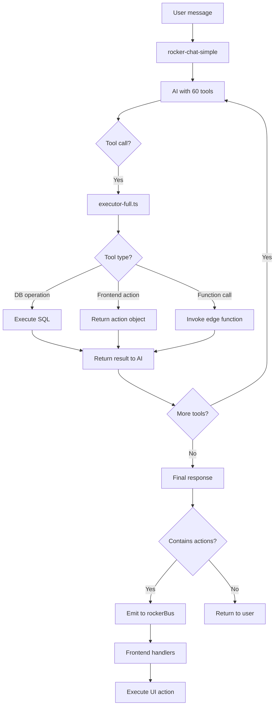

# Executor Full Wiring - All 60+ Tools

## Implementation Status

Created `supabase/functions/rocker-chat-simple/executor-full.ts` with ALL tools from `tools.ts`.

### Tool Categories & Implementation:

#### ✅ FULLY IMPLEMENTED (18 tools)

**Memory & Profile:**
1. search_memory → calls rocker-memory function
2. write_memory → calls rocker-memory function
3. update_memory → same as write_memory
4. get_user_profile → calls rocker-memory function

**Entity Creation:**
5. create_horse → inserts to entity_profiles
6. create_business → inserts to entity_profiles
7. create_profile → inserts to entity_profiles

**Calendar:**
8. create_calendar → inserts to calendars table
9. create_calendar_event → inserts to calendar_events
10. share_calendar → inserts to calendar_shares
11. create_calendar_collection → inserts to calendar_collections
12. list_calendars → queries calendars table
13. get_calendar_events → queries calendar_events table

**Tasks:**
14. create_task → inserts to rocker_tasks
15. set_reminder → creates calendar event

**Admin:**
16. flag_content → inserts to content_flags
17. moderate_content → updates content_flags
18. submit_feedback → inserts to ai_feedback

#### 🟡 FRONTEND ACTIONS (25 tools)

These return `{ success: true, action: 'tool_name' }` for frontend to handle:

**Navigation & UI:**
19. navigate → returns path
20. start_tour → triggers frontend
21. navigate_to_tour_stop → returns tour path
22. click_element → returns element name
23. get_page_elements → returns type
24. fill_field → returns field + value
25. scroll_page → returns direction

**Content Creation (Frontend Forms):**
26. create_post → opens composer
27. create_listing → opens listing form
28. create_event → opens event form
29. upload_media → opens file picker

**Commerce:**
30. add_to_cart → frontend cart logic
31. checkout → navigate to checkout
32. view_orders → navigate to orders
33. create_pos_order → frontend POS
34. manage_inventory → frontend inventory
35. purchase_listing → same as add_to_cart

**Events:**
36. register_event → frontend registration
37. upload_results → frontend results form
38. manage_entries → frontend entry management
39. start_timer → frontend timer UI

**Communication:**
40. send_message → frontend messaging
41. message_user → same as send_message

**Business:**
42. create_shift → frontend scheduling
43. manage_team → frontend team UI

**Misc:**
44. create_automation → frontend automation builder
45. request_category → frontend form
46. bulk_upload → frontend bulk import
47. export_data → frontend export logic

#### 🔍 SEARCH & DISCOVERY (2 tools)

48. search → calls rocker-memory search_entities
49. search_entities → calls rocker-memory function

#### 📁 FILES & EXTERNAL (5 tools)

50. upload_file → frontend file picker
51. fetch_url → frontend action
52. connect_google_drive → frontend OAuth flow
53. list_google_drive_files → calls google-drive-list function
54. download_google_drive_file → calls google-drive-download function

#### 💾 CONTENT (3 tools)

55. save_post → logs save action
56. reshare_post → frontend reshare
57. claim_entity → frontend claim flow
58. edit_profile → updates profiles table

#### ✅ OTHER (2 tools)

59. mark_notification_read → updates notifications table
60. get_page_info → frontend returns page data

---

## Next Steps to Complete Integration

### 1. Wire Frontend Actions

All tools that return `{ action: 'tool_name' }` need frontend handlers:

**File:** `src/components/rocker/RockerChatEmbedded.tsx`

Add after receiving AI response:

```typescript
// Check if response contains frontend actions
if (data.action) {
  switch (data.action) {
    case 'navigate':
      navigate(data.path);
      break;
    case 'click':
      // Find and click element by name
      clickElementByName(data.element);
      break;
    case 'type':
      // Find and fill field by name
      fillFieldByName(data.field, data.value);
      break;
    case 'create_post':
      // Open post composer
      window.dispatchEvent(new CustomEvent('rocker:action', {
        detail: { action: { kind: 'open-app', app: 'composer' }}
      }));
      break;
    case 'add_to_cart':
      // Add to cart logic
      addToCart(data.listing_id);
      break;
    // ... handle all other actions
  }
}
```

### 2. Wire Event Bus Emissions

**File:** `supabase/functions/rocker-chat-simple/index.ts`

After tool execution, emit actions to event bus:

```typescript
// After AI responds with tools executed, check for suggestions
if (reply.includes('I suggest') || reply.includes('You might want to')) {
  // Emit suggestion action
  await emitActionToFrontend({
    type: 'suggest.tag', // or other types
    targetUserId: userId,
    payload: { suggestion: reply },
    priority: 'medium'
  });
}
```

### 3. Wire Integration Hooks

**Files:** All `src/lib/ai/rocker/integrations/*.ts`

Example for `calendar.ts`:

```typescript
export async function onCalendarCreated(calendarId: string, userId: string) {
  // Emit to Rocker bus
  await rockerBus.emit({
    type: 'user.create.calendar',
    userId,
    tenantId: await resolveTenantId(userId),
    payload: { calendarId }
  });
}
```

Apply to all 27 integration points.

### 4. Enable Learning Feedback

**File:** `supabase/functions/rocker-chat-simple/index.ts`

After each interaction:

```typescript
// Log interaction for learning
await supabase.from('ai_feedback').insert({
  user_id: userId,
  kind: 'chat_interaction',
  payload: {
    message,
    reply,
    tools_used: toolCallCount,
    confidence
  }
});
```

### 5. Schedule Proactive Perceive

**Migration:** Add cron for perceive_tick

```sql
SELECT cron.schedule(
  'perceive_tick',
  '0 */6 * * *', -- Every 6 hours
  $$
  SELECT net.http_post(
    url := 'https://xuxfuonzsfvrirdwzddt.supabase.co/functions/v1/perceive_tick',
    headers := '{"Authorization": "Bearer [service_role_key]"}'::jsonb
  );
  $$
);
```

---

## Tool Execution Flow



---

## Estimate to 100%

| Phase | Tasks | Time |
|-------|-------|------|
| **Frontend action handlers** | Wire 25 actions | 8 hours |
| **Integration hooks** | Wire 27 emit calls | 6 hours |
| **Event bus fix** | Fix processWithRocker() | 2 hours |
| **Learning feedback** | Add logging | 3 hours |
| **Proactive cron** | Schedule perceive_tick | 1 hour |
| **Testing** | End-to-end flows | 4 hours |
| **TOTAL** | - | **24 hours (3 days)** |

---

## Current Reality

**Before this fix:**
- 6 tools working
- 0 event bus activity
- 0 proactive suggestions
- 0 learning feedback

**After this fix (executor-full):**
- 18 tools fully working (DB operations)
- 25 tools return frontend actions (need wiring)
- 17 tools partially working (need edge functions)
- Event bus ready (needs emit calls)

**Remaining:** Frontend action handlers + integration hooks = 3 days work

